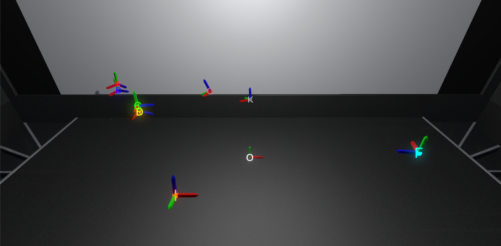

## Use HTC Vive Tracker devices in Unity3D with the following benefits
- Directly use OpenVR API for best performance
- Small library, easy to integrate in any projects
- A simulator, to develop without having a Vive tracking system connected
- Real-time pre-processing of tracking data to avoid noises in trajectories
- A complete test scene to understand the use of the library
- Some [documentation](Doc/ViveTrackersDocumentation.pdf) to setup Unity3D, SteamVR (with & without HMD) and Windows to get the best tracking quality from your Vive Trackers

## Getting Started
#### 1. Open SteamVR, configure your tracking space, connect your Vive Trackers, and leave SteamVR running in the background.
#### 2. Open the ViveTrackersTest scene in Unity and press Play.
#### 3. See the script [ViveTrackersTest.cs](Scripts/ViveTrackersTest.cs), especially the Update() function (line 52-77) : you will see that you can press F1/F5/F6/F7/F8 keys to control the application.
- The first line of the Update() function updates all trackers position & rotation (see [ViveTrackersManager.cs](Scripts/ViveTrackersManager.cs) line 93-109).
ViveTrackersManager contains a list of all instances of ViveTracker objects, named "_trackers". 
You can access the last position & rotation of ViveTracker objects using transform.localPosition & transform.localRotation.
- The F5 key is to refresh the list of currently connected trackers.
#### 4. Optionally, ViveTrackersManager can use only a restricted set of Vive Trackers using the file ViveTrackers.csv (see [documentation/"Keep Vive Trackers identification consistent during runtime"](Doc/ViveTrackersDocumentation.pdf)).

## System requirements
Unity ***2017.4.35f1*** and newer versions
